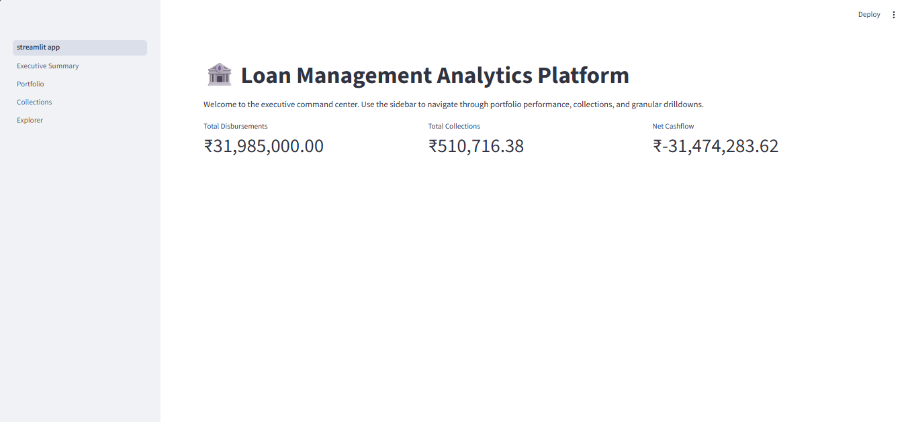
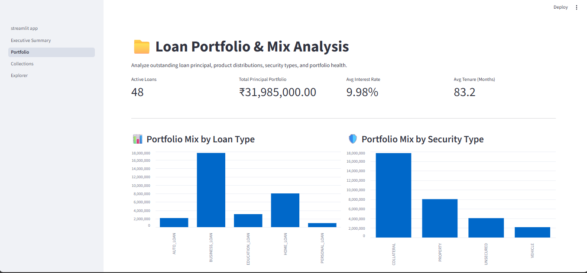
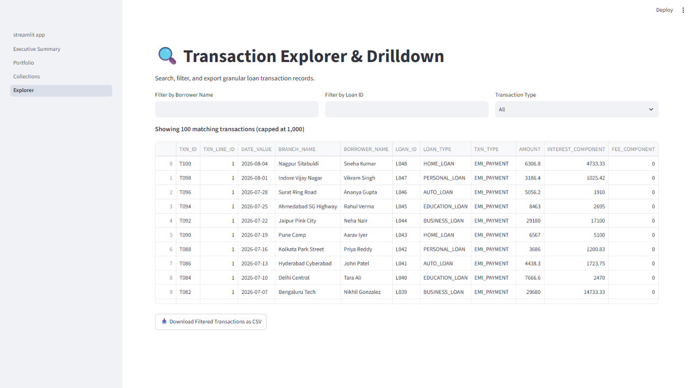
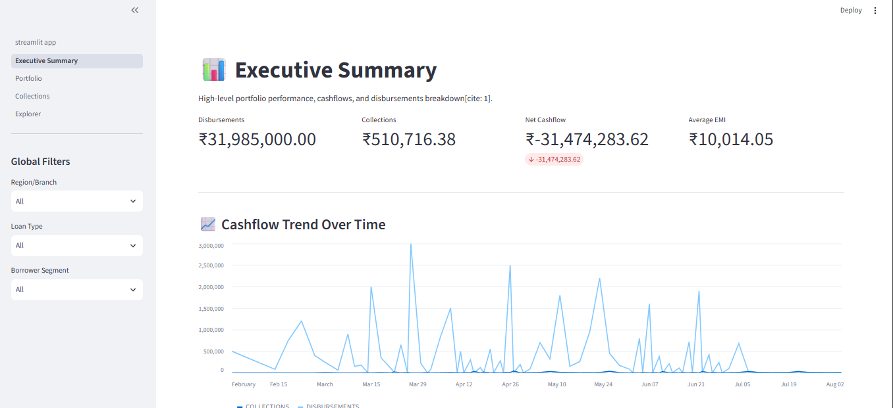
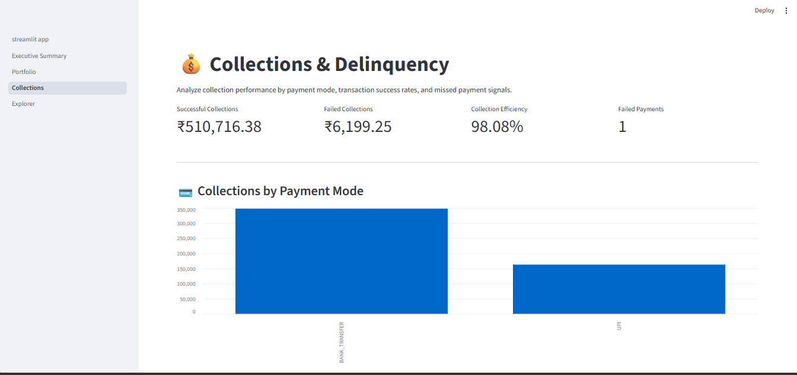

# Loan Management Analytics Platform

A modern **data engineering and analytics platform** built using **Snowflake, Snowpipe, dbt, SQL, Python, and Streamlit** to ingest, transform, validate, and analyze loan-management data.

---

## 📌 Project Overview

The **Loan Management Analytics Platform** processes data related to:

* Borrowers
* Branches
* Loans
* Loan transactions / EMI payments

The platform follows a layered data architecture where source data is ingested into Snowflake, transformed using dbt, modeled into analytical fact and dimension tables, and exposed through a Streamlit dashboard.

The project demonstrates practical data engineering concepts including **data ingestion, ELT, dimensional modeling, incremental processing, SCD Type 2, data quality testing, and analytics**.

---

## 🏗️ Architecture

```text
                    Source CSV Files
                           │
                           ▼
                     Landing Zone
                           │
                           ▼
                        Snowpipe
                           │
                           ▼
                  Raw Snowflake Tables
                           │
                           ▼
                     dbt Staging
                           │
                           ▼
                Dimensions + Fact Models
                           │
                           ▼
                Semantic / Analytics Layer
                           │
                           ▼
                    Streamlit Dashboard
```

### Architecture Flow

1. Source CSV files are placed in the landing layer.
2. Snowpipe automatically ingests the files into Snowflake.
3. Raw tables retain ingestion metadata and source information.
4. dbt staging models clean and standardize the raw data.
5. Dimension and fact models transform the data into an analytical structure.
6. dbt snapshots maintain historical changes for selected entities.
7. The semantic/analytics layer provides business-ready data.
8. Streamlit provides an interactive interface for analysis.

---

## 🛠️ Technology Stack

| Technology        | Purpose                                        |
| ----------------- | ---------------------------------------------- |
| **Snowflake**     | Cloud data warehouse                           |
| **Snowpipe**      | Automated file ingestion                       |
| **dbt**           | Data transformation, modeling, and testing     |
| **Snowflake SQL** | Data processing and analytical transformations |
| **Python**        | Streamlit application and supporting logic     |
| **Streamlit**     | Interactive analytics dashboard                |
| **Git/GitHub**    | Version control and project collaboration      |

---

## 📂 Project Structure

```text
loan_mgmt_transformation/
│
├── analyses/
├── macros/
│
├── models/
│   ├── staging/
│   │   ├── stg_borrowers.sql
│   │   ├── stg_branches.sql
│   │   ├── stg_loans.sql
│   │   └── stg_loan_txn.sql
│   │
│   ├── dimensions/
│   │   ├── dim_date.sql
│   │   ├── dim_branch.sql
│   │   └── ...
│   │
│   └── facts/
│       ├── fact_loan_txn.sql
│       └── ...
│
├── snapshots/
│   ├── dim_borrower_snapshot.sql
│   └── dim_loan_snapshot.sql
│
├── seeds/
├── tests/
│
├── streamlit_app/
│   └── app.py
│
├── outputs/
│   ├── app_page.png
│   ├── collections.png
│   ├── portfolio.png
│   ├── summary.png
│   └── transaction_explorer.png
│
├── dbt_project.yml
├── .gitignore
└── README.md
```

---

## 🔄 Data Pipeline

### 1. Data Ingestion

Source files containing borrower, branch, loan, and transaction information are placed in the landing layer.

**Snowpipe** loads the files into Snowflake raw tables.

The ingestion process captures metadata such as:

* `LOAD_TS`
* `FILE_NAME`
* `ROW_NUMBER`

Invalid records can be redirected to a rejection/quarantine area for further investigation.

---

### 2. Staging Layer

dbt staging models standardize and clean the raw data.

Examples:

```text
stg_borrowers
stg_branches
stg_loans
stg_loan_txn
```

Typical transformations include:

* Data type standardization
* Column renaming
* Null handling
* Data cleansing
* Source-level filtering

The staging layer provides a clean foundation for downstream analytical models.

---

### 3. Dimension Models

The project creates reusable analytical dimensions such as:

```text
dim_date
dim_branch
```

Historical borrower and loan information is maintained through dbt snapshots:

```text
dim_borrower_snapshot
dim_loan_snapshot
```

This allows historical changes to important business entities to be preserved.

---

### 4. Fact Model

The central transactional model is:

```text
FACT_LOAN_TXN
```

The grain of the fact table is:

```text
TXN_ID + TXN_LINE_ID
```

Each row represents an individual transaction line.

The fact model supports analysis such as:

* Loan disbursement analysis
* EMI/payment analysis
* Outstanding amounts
* Branch-level analysis
* Loan-type analysis
* Borrower-segment analysis

---

## 🔁 Incremental Processing

The transaction fact model uses **dbt incremental processing**.

Instead of rebuilding the entire fact table during every execution, new or changed records can be processed incrementally.

The model uses:

```text
TXN_ID + TXN_LINE_ID
```

as its unique business key.

This approach helps reduce unnecessary processing as transaction volume increases.

---

## 📸 Historical Data with SCD Type 2

The project uses **dbt snapshots** to maintain historical versions of selected entities.

Examples:

```text
dim_borrower_snapshot
dim_loan_snapshot
```

Snapshot metadata includes fields such as:

```text
DBT_VALID_FROM
DBT_VALID_TO
DBT_SCD_ID
```

This allows the analytical layer to retain historical versions of borrower and loan attributes rather than only storing the latest state.

---

## 🧪 Data Quality

dbt tests are used to validate the transformed data.

Examples include:

* `not_null`
* `unique`
* `relationships`
* Accepted-value validations

These tests help identify data-quality issues before the data is consumed by downstream analytics.

Run tests with:

```bash
dbt test
```

Build models and execute associated tests with:

```bash
dbt build
```

---

## 📊 Streamlit Dashboard

The project includes a **Streamlit application** for exploring the transformed loan data.

The dashboard provides analytical views across dimensions such as:

* Region
* Loan type
* Borrower segment
* Branch
* Transaction information

Run the application locally with:

```bash
streamlit run streamlit_app/app.py
```

> The Streamlit application requires a valid Snowflake connection. Credentials should be supplied through Streamlit secrets or environment variables and must never be committed to GitHub.

---

## 📸 Project Screenshots & Outputs

The following screenshots demonstrate the analytical outputs and Streamlit application developed for the project.

### 📊 Application Overview



### 📈 Portfolio Analysis



### 💳 Transaction Explorer



### 📋 Loan Summary



### 📚 Collections Analysis



---

## ⚙️ Setup

### Prerequisites

Install the following:

* Python
* dbt
* dbt-snowflake
* Snowflake account
* Streamlit

Install the required Python packages:

```bash
pip install dbt-snowflake streamlit snowflake-snowpark-python
```

### Configure dbt

Create your local dbt profile:

```text
~/.dbt/profiles.yml
```

The profile should contain your Snowflake connection details.

**Do not commit `profiles.yml` to GitHub.**

---

## ▶️ Running the Project

From the project directory:

### Check dbt Configuration

```bash
dbt debug
```

### Install dbt Dependencies

```bash
dbt deps
```

### Run dbt Models

```bash
dbt run
```

### Run Data Quality Tests

```bash
dbt test
```

### Build Models and Run Tests

```bash
dbt build
```

### Run Streamlit

```bash
streamlit run streamlit_app/app.py
```

---

## 🔐 Security

Credentials and secrets are intentionally excluded from this repository.

The following files should **never** be committed:

```text
profiles.yml
.env
.streamlit/secrets.toml
```

Use `.gitignore`, environment variables, or Streamlit secrets to manage credentials securely.

---

## 🎯 Key Data Engineering Concepts Demonstrated

This project demonstrates practical implementation of:

* Cloud data warehousing
* Snowflake
* Snowpipe
* ELT pipelines
* dbt transformations
* dbt incremental models
* dbt snapshots
* SCD Type 2
* Fact and dimension modeling
* Data quality testing
* SQL transformations
* Data ingestion metadata
* Rejected-record handling
* Historical data tracking
* Analytics / semantic layer
* Streamlit data applications
* Git/GitHub version control

---

## 📌 Project Status

The core data pipeline, Snowflake ingestion layer, dbt transformation layer, historical tracking, analytical models, and Streamlit analytics layer have been developed as part of the project.

Potential future enhancements include:

* Workflow orchestration using Airflow
* CI/CD for dbt
* Pipeline monitoring and alerting
* Additional analytical dashboards
* Automated data-quality monitoring

---

## 📚 Resources

* [dbt Documentation](https://docs.getdbt.com/)
* [Snowflake Documentation](https://docs.snowflake.com/)
* [Streamlit Documentation](https://docs.streamlit.io/)
